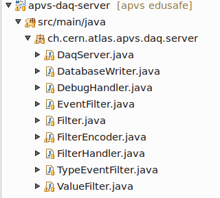
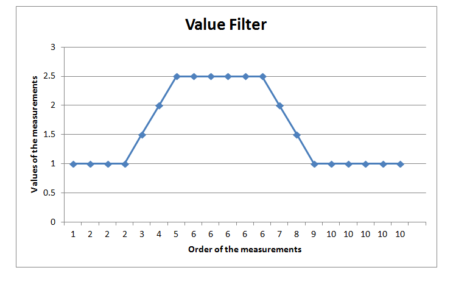
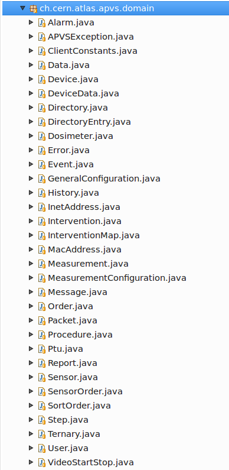
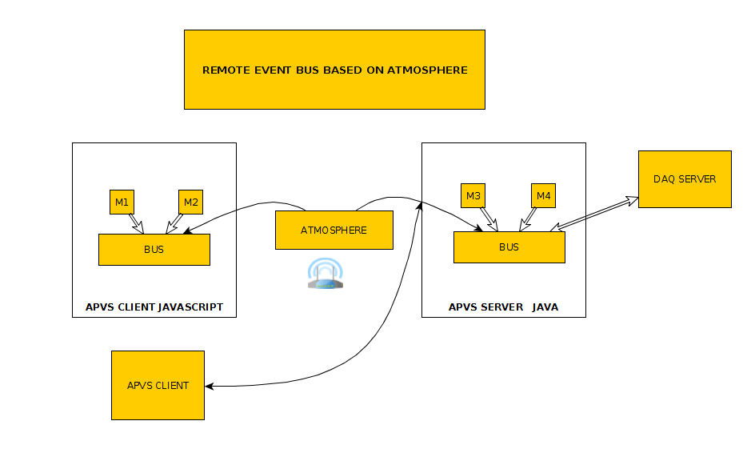

###**APVS** is the ATLAS Procedures Visualizer System for the Wireless Safety System.

----
----
__APVS WEBSERVER__

APVS project is a GWT application that contains the apvs-server and the Graphical User Inerface (Web-Client).
Code for the Data Acquisition Server (DAQ Server) is also provided and will be described in this documentation.
A Data Base is also needed to persist the data received from the devices. We are using an Oracle DB and SQL Developer.

 **GUI** 

The GUI is the web client application of apvs, it is written in Java (converted in JS) and connects to the apvs-server via [Atmosphere](https://github.com/Atmosphere/atmosphere), the Asynchronous WebSocket/Comet Framework.
The user interface is providing the supervisor with the following information:

**Sensor Data** from the PTU(personal transmitting unit) device: O2, CO2, Barometric pressure, Accumulation Dose, Dose Rate, Temperature

**Video streams.** For example in EDUSAFE project we stream from the Augmented Reality Prototype (AR prototype) the worker's view from his hand-held or helmet camera while he works at the ATLAS cavern, for supervision purposes.

**Plots** of the measurements that are received from PTUs.

**apvs-asterisk** 

Asterisk is a communication server. It is the communication toolkit used for real-time communication in apvs project. 
It is read-only but upgradeable. 
Asterisk handles all the low level details of sending and receiving data using lots of different communication protocols. 
For a communications application to work, we need the communications server connected to communication services (VoIP or PSTN).
Voice over IP (VoIP) is a methodology and group of technologies for the delivery of voice communications and multimedia sessions over Internet Protocol (IP) networks, such as the Internet.
The server components are handling all of the low level details of the underlying protocols.
Asterisk-Java is the free Java library for Asterisk PBX (projet builder) integration.
We use Asterisk to achieve the communication between the PTU devices and setup conferences. Each PTU is an asterisk-client.
  
  For more information visit:
  [1](https://wiki.asterisk.org/wiki/display/AST/AMI+v2+Specification#AMIv2Specification-Introduction),
  [2](https://wiki.asterisk.org/wiki/display/AST/Asterisk+as+a+Swiss+Army+Knife+of+Telephony),
  [3](http://www.voip-info.org/wiki/view/Asterisk+manager+API)

**apv-charts**

In order to create the plots we are using GWT Highcharts which is a comprehensive API enabling the use of Highcharts within a GWT application. 
Highcharts is a charting library written in pure JavaScript, offering intuitive, interactive charts to our website or web application.
Supports line, spline, area, areaspline, column, bar, pie and scatter chart types.  [GWT Highcharts](http://www.moxiegroup.com/moxieapps/gwt-highcharts/)   
Since Highcharts is written in JS we are using a java wrapper from the moxie group to deliver the jar file. It is a freely available open source library that 
provides an elegant and feature complete approach for including Highcharts and Highstock visualizations within apvs GWT application using pure Java code 
(including GWT widget libraries, such as SmartGWT or Ext GWT). 

**apvs-configuration**

APVS configuration is an apache configuration. 

The Project Object Model or POM is the fundamental unit of work in Maven. It is an XML file that contains information about the project 
and configuration details used by Maven to build the project. Examples for this is the build directory, which is target; the source directory, which is 
src/main/java;the test source directory, which is src/test/java; and so on.

Instead of having a maven.xml file that contains the goals that can be executed, the goals or plugins are now configured in the pom.xml. When executing a task or 
goal, Maven looks for the POM in the current directory. It reads the POM, gets the needed configuration information, then executes the goal.

Some of the configuration that can be specified in the POM are the project dependencies, the plugins or goals that can be executed, the build profiles, the versions that we are using for example Atmosphere,Bootstrap, Nettosphere and so on.  

If needed to update commons-configuration in order to read the configuration files of apvs you need to do the following:

compile commons-configuration in ~/cern/svn/
copy commons-configuration-2.0-SNAPSHOT.jar to current dir with svn version number
copy commons-configuration-2.0-SNAPSHOT-sources.jar to current dir with svn version number
copy pom.xml to current dir as commons-configuration-2.0-SNAPSHOT-pom.xml with svn version number

**apvs-converter**

Needs further developing but the idea is that it will convert the recorded points of the measurements to periodically saved points. This is needed in case a value 
of a certain measurement stays the same for a long period of time. 

Uses Hibernate to access the Data Base.
Hibernate is an ORM tool (Object Relational Mapping): Idiomatic persistence for Java and relational databases. 

A class corresponds to a table and an object corresponds to a row of a table.
Each object needs to be converted in a sequence query for saving and then for retrieving we have to convert a record set on to an object. 
Hibernate solves the problem of this mapping.

For Data navigation:

The way you access data in Java is fundamentally different than the way you do it in a relational database.
In Java, you navigate from one association to an other walking the object network.
This is not an efficient way of retrieving data from a relational database. 
You typically want to minimize the number of SQL queries and thus load several entities via JOINs and select the targeted entities before you start walking the 
object network.

Read more here about Hibernate: http://hibernate.org/orm/

**apvs-daq-server** 

Contains the code for Data Acquisition of various sensors.
There are several classes under apvs-daq-server --> src/main/java --> ch.cern.atlas.apvs.daq.server :

**a) DaqServer**

Sets the inport, outport and filterport. Filterport is created in order to provide for example to the UI of the AR ptotype(EDUSAFE) specific measurements like DoseRate, Dose Accumulation.

All the messages that we are currently receiving are in JSON format. 

Json Message Encoder 
Replaying decoder makes sure that the json message is fully received.
 
**b) DatabaseWriter**

Connects to the bus, takes every message and stores it in the DB.

There are four types of messages we receive:

**1)** general configuration (in json is key values pairs) and tells you which access point it is connected, which dosimeter it is actually connected to.

**2)** measurement conf. shows the limits for the measurement (thresholds)

**3)** events  --->alarms, shut down , boot, switch on/off, events happen occasionally.

**4)** measurements in regular basis.

**c) DebugHandler:** what goes on and off the bus, it is saved in a log file, for every message.

**d) EventFilter:** To filter the events that go into the DB.

**e) Filter:** The interface for filtering the measurements.

**f) TypeEventFilter** (Currently not used)

**g) ValueFilter** (Currently not used)

Every measurement that comes from the PTU has a timestamp and the DB keeps a record of every measurement (ID, Unit, Time, Value).

The first and the second measurement are stored. If the third measurement has the same value as the two previous measurements we move it by changing the timestamp 
in order to gain space in the DB.

The functionality is shown in the following Plot.

Check through "messagetothebus" declaration if needed to be used. 

To define an inport for receiving data and an outport to send data, edit the APVS.properties file of the apvs-daq-server. 

*Example:*
 
*APVS.daq.inport=10123*

*APVS.daq.outport=10124*

*APVS.daq.filterport=10125*

**apvs-dist**  Building the distibution, creates a tar or zip file of the whole apvs project (war files).

**apvs-domain**

Contains everything that is related to the records that are written to the data-base or the java classes of either the apvs-server or the DAQ-server. See the 
classes that are included in Picture.
For ex. it contains the class GeneralConfiguration.java that gives information such as the bssid which is the name of the network that the PTU is connected 
(access point).
This class is saving the following information in TBL_GENERAL_CONFIGURATION of the DB: ID, DEVICE_ID, DATETIME, BSSID, DOSIMETER_ID.
This table is an annotation( if there is a record in this particular class and Hibernate retrieves it, it gives an object of this class)

A second example of the classes that are included in domain is the class MacAddress.java that is providing the Mac address of the PTU. This information is saved 
in TBL_DEVICES of the DB.
We have included some extra Hibernate types in order for Hibernate to recognize the Mac address, converts MAC address into String.

**apvs-eventbus**

Standard java comes with an event bus so that in our application instead of making all the different modules that we want to connect
to each other (and making them all depended on each other), we can standardize the way the information is sent between them in the form of events
and then standardize an event-bus.

So all the different modules that are included on the event-bus are updated when an event occurs, sequentially(there is no threading).

That is good because you have all the modules depended on a packadge, called domain, where you have included all the types of events.

In order to connect between two java applications we connect through network all the different modules of each application(M1,M2,M3,M4)
to the bus. We are using Atmosphere in order to have both directions communication between the apvs-client(JS) and apvs-server(Java) as it is shown
in picture. (If it was both java we could use instead of Atmosphere, Nettyio).

We can build a remote event-bus where someone can push a button in the interface, that goes to the bus, gets connected and goes to the server.

It is important that we can connect to the DAQ server so that every message that comes from the DAQ server(json messages for ex.) goes on to the bus
and is transmitted to every single client through Atmosphere. So this way we can connect to more apvs clients that each has a bus as well. 

So in the remote event bus you can say I am subscribing to a particular event and then ot filters that event. So if you are sending measurements
they automatically go to the panel where the measurements go. If you are subscribing to events it will go to event panel.

Everything that is compiled in JS it needs to be in a different packadge (client-shared), not a module.

**apvs-jetty**

Jetty is the container-server that can provide all the info from the war files.

**apvs-json-io**

Json-io consists of two main classes, a reader (JsonReader) and a writer (JsonWriter). json-io eliminates the need for using ObjectInputStream / ObjectOutputStream to serialize Java and instead uses the JSON format. Read more [here](https://github.com/jdereg/json-io).

**apvs-ptu**

It is a PTU-simulator in order to mimic the received JSON messages. 

