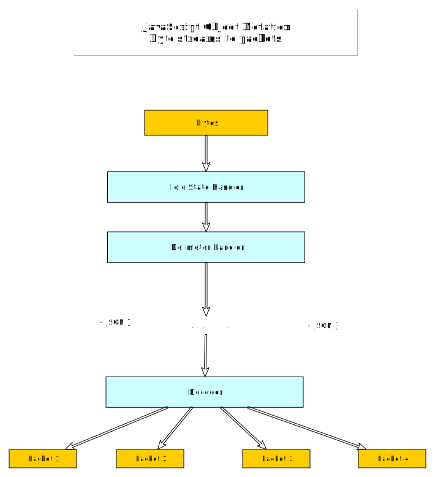

###**APVS** is the ATLAS Procedures Visualizer System for the Wireless Safety System.

----
----
__APVS WEBSERVER__

 **GUI** 

The web client application of apvs is written in java (then converted in javascript) and it connects to the server via [Atmosphere](https://github.com/Atmosphere/atmosphere), the Asynchronous WebSocket/Comet Framework.
The user interface is providing the supervisor with the following information:

Sensor Data,Video, Plots, 

**apvs-asterisk** 

Asterisk is a communication server. It is the communication toolkit used for real-time communication in apvs project. 
  Although it is read-only, it is upgradeable. 
  Asterisk handles all the low level details of sending and receiving data using lots of different communication protocols. 
  For a communications application to work, you need the communications server connected to communication services (VoIP or PSTN).
  Voice over IP (VoIP) is a methodology and group of technologies for the delivery of voice communications and multimedia sessions over Internet Protocol (IP) networks, such as the Internet.
  For people to access your communications system you need phone numbers or VoIP URIs that send calls to your server.
  The server components are handling all of the low level details of the underlying protocols.
  Your application doesn't have to worry about the byte alignment, the packet size, the codec or any of the   thousands of other critical details that make the application work. 
  This is the power of an engine.
  Asterisk-Java is the free Java library for Asterisk PBX (projet builder) integration.
  
  For more information visit:
  [1](https://wiki.asterisk.org/wiki/display/AST/AMI+v2+Specification#AMIv2Specification-Introduction),
  [2](https://wiki.asterisk.org/wiki/display/AST/Asterisk+as+a+Swiss+Army+Knife+of+Telephony),
  [3](http://www.voip-info.org/wiki/view/Asterisk+manager+API)

**apv-charts**

In order to create the plots we are using GWT Highcharts which is a comprehensive API enabling the use of Highcharts within a GWT application. 

  [GWT Highcharts](http://www.moxiegroup.com/moxieapps/gwt-highcharts/)   ,the moxie group   deliver the jar file is a freely available open source library that provides an elegant and feature complete approach for including Highcharts 
  and Highstock visualizations within a GWT application using pure Java code (including GWT widget libraries, such as SmartGWT or Ext GWT). 

  Highcharts is a charting library written in pure JavaScript, offering intuitive, interactive charts to your own website or web application.
  They support line, spline, area, areaspline, column, bar, pie and scatter chart types.

  

